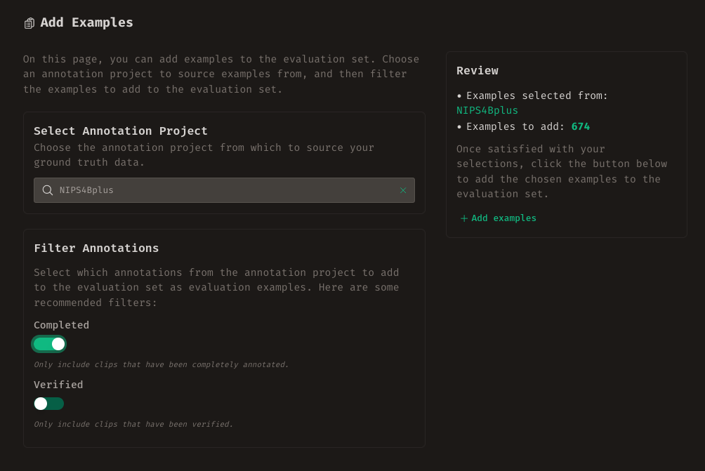
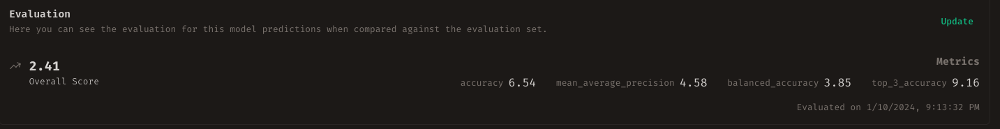

# Evaluation

While the primary focus of Whombat revolves around annotation work, we
acknowledge that annotation is just one facet of the ML development workflow.
Whombat aims to enhance this workflow by not only providing tools for generating
annotations but also offering features to comprehend the performance of ML
models trained with these annotations.

In this section, we will delve into leveraging the annotations created through
your efforts to evaluate and explore ML model and annotator predictions. The
topics we will cover include:

1. [Understanding predictions](#understanding-predictions)
2. [Evaluation Sets](#evaluation-sets)
3. [Creating or Importing an Evaluation Set](#creating-or-importing-an-evaluation-set)
4. [Selecting Evaluation Tags](#selecting-evaluation-tags)
5. [Adding Examples to the Evaluation Set](#adding-examples)
6. [Importing a Model Run](#importing-a-model-run)
7. [Evaluating the Model Run](#evaluating-the-model-run)
8. [Exploring the Predictions](#exploring-the-predictions)

## Understanding Predictions

In Whombat, predictions share similarities with
[annotations](annotation_projects.md#understanding-annotation). Like
annotations, predictions exist in two forms: **sound event** and **clip
predictions**. Predicted sound events encompass a Region of Interest (RoI)
suspected to contain a relevant sound, along with associated tags. On the other
hand, clip predictions consist of tags that potentially match the audio content
of the clip, along with the predicted sound events within the clip. Noteworthy
differences from regular annotations include a somewhat philosophical
stance—predictions are generally considered less trustworthy than annotations.
Additionally, predictions often come with a quantification of certainty.

In Whombat, sound event predictions feature an accompanying **confidence
score**, aiming to quantify the level of certainty the ML model or user has
regarding the presence of that sound event. Predicted tags also carry a
confidence score. For instance, a predicted sound event could be associated with
two tags: "sound:Airplane" with a confidence score of 80% and "sound:Human" with
a confidence score of 20%. Importantly, this combination doesn't create a
contradiction; instead, it provides nuanced insights into the confidence levels
associated with each predicted tag.

Sets of predictions are organized into **Model Runs** or **User Runs**. These
collections gather predictions created with the same model or by the same user,
under identical configurations and singular conditions. These prediction sets
can then be evaluated against the ground truth.

## Evaluation Sets

In the evaluation process, it's common to assess a model or user by comparing
their predictions against a set of known examples. To facilitate this, Whombat
has organized the entire evaluation module around the concept of **evaluation
sets**.

An evaluation set is essentially a curated collection of fully annotated audio
clips. These clips serve as benchmark examples for comparing predictions.
Evaluation sets can be sourced from existing annotation projects or directly
imported from other sources. Similar to annotation sets, evaluation sets often
concentrate on specific types of sounds. Therefore, an evaluation set is
associated with a set of tags that define the focus areas for assessment.

Each evaluation set should be tailored to a specific **task**—a particular
problem in computer audition being evaluated. This determination not only
defines the types of expected predictions but also, crucially, shapes the
evaluation criteria for assessing these predictions.

!!! info "Supported Tasks"

    In Whombat, we currently support four different types of computer audition tasks:

    * **Clip Classification**: In this task, the user or model is expected to
    correctly predict the class to which an audio clip belongs. The true class is
    determined by the tag attached to the clip.

    * **Clip Tagging**: In this task, the user or model is
    expected to predict a set of tags attached to an audio clip.

    * **Sound Event Classification**: For this task, the user or model is
    expected to correctly predict the class to which each sound event in the
    evaluation set belongs. The true class is determined by the tag attached to the
    sound event. In this scenario, it is expected that the user/model is provided
    with the Region of Interest (RoI) of the sound event for inference.

    * **Sound Event Detection**: In this task, the user or model is expected to
    correctly locate each relevant sound event and predict the correct tag set for
    each sound event. This involves estimating the RoI and predicting the tag set,
    making it a simultaneous localization and classification problem.

To begin working with an evaluation set, click on the Evaluation button on the
sidebar (labeled **C** in the figure) or use the navigation cards on the
homepage. Here, you'll find a list of existing evaluation sets. You can search
for a particular set using the search bar or create a new one. Clicking on a set
provides detailed insights into its contents.

## Creating or Importing an Evaluation Set

To create a new evaluation set, click on the **+Create** button at the top
right. You will be prompted to provide a **name**, a **description** and the
**task** for the evaluation set.

Alternatively, if you already have an evaluation set saved in an AOEF file, you
can import it directly by clicking on the **Import** button and selecting the
appropriate file.

??? tip "Creating AOEF files"

    For an efficient way to generate AOEF files with your own data, we
    recommend using the [`soundevent`](https://mbsantiago.github.io/soundevent/)
    package. This package offers user-friendly functions aligned with Whombat's
    data structure, facilitating a seamless integration process.

Once created or imported, you will be redirected to the Evaluation Set Dashboard
for further management and exploration.

## The Evaluation Set Dashboard

The Evaluation Set Dashboard offers a concise summary of key information related
to the evaluation set and its associated elements. The overview section provides
a snapshot, displaying the count of registered examples, the number of tags
utilized for evaluation, and the tally of model runs and user sessions imported
for this specific evaluation set.

Within the dashboard, you'll find details about the most recent model and user
runs, along with insights into their respective evaluations. Additionally,
information about the evaluation set, including its description and name, is
readily accessible and editable.

!!! tip "Downloading the Evaluation Set"

    Clicking the **Download** button in the dashboard allows you to download
    the evaluation set information. This download includes details about the
    contained clips and their corresponding ground truth annotations. This
    information proves valuable for extracting the corresponding audio material and
    running a model to create a Model Run.

??? warning "Deleting the Evaluation Set"

    Exercise caution when using the **Delete** button, as it will permanently
    remove the evaluation set. This action includes the deletion of any associated
    model and user runs, along with their respective evaluations. Ensure you are
    certain about this decision or have appropriate backups in place.

## Selecting Evaluation Tags

To manage evaluation tags for the current evaluation set, click on the **Tags**
button in the navigation header. You'll be redirected to a page where you can
easily handle evaluation tags. On the right column, you'll find all the
currently registered evaluation tags. Click on a tag to remove it. Use the
search bar on the left column to find registered tags, create new ones, and
select a tag to add it to the evaluation set.

!!! tip "Selecting a Good set of Evaluation Tags"

    Selecting evaluation tags is a crucial step in assessing predictions.
    Annotated data or predictions may have additional tags that aren't directly
    relevant to the evaluation task. These tags define which ones will be used for
    assessment.

    The usage of tags depends on the evaluation task. For instance, in the clip
    classification task, the tag set is considered the possible classes a clip can
    take. Ensure you choose a tag set aligned with your evaluation goals.

!!! warning "Updating the tag set"

    It's recommended to select a comprehensive set of tags for evaluation from
    the beginning. Evaluations depend on the tag set, and assessments made with
    different tag sets aren't directly comparable. If you need to change the tag
    set, update all evaluations accordingly.

## Adding Examples

To add examples to the evaluation set, click on the "Examples" button in the
navigation header. Adding examples involves two steps. First, select an
annotation project as the source for examples. The added examples are clip
annotations from the chosen project. Then, precisely choose which clips to add
from the selected project by applying filters to the annotations. For instance,
it's recommended to add only annotations marked as fully annotated (completed).
After reviewing the number of examples to add, click Add when satisfied.

## Importing a Model Run

After completing the setup, you are ready to import and evaluate model runs to
explore their predictions. Navigate to the "Model Runs" tab in the navigation
header to view the list of all registered model runs. Click on the import button
next to the search bar and select the file containing the model run predictions.

!!! info "Data Format"

    Model runs are expected to be in AOEF format. For more information on this
    format, refer to [soundevent](https://mbsantiago.github.io/soundevent).

!!! tip "Creating your Model Runs"

    It's recommended to use the
    [`soundevent`](https://mbsantiago.github.io/soundevent) package to format your
    data. This package provides tools to structure your data in a way that closely
    resembles Whombat data and has handy functions to export the data directly into
    AOEF format.

## Evaluating the Model Run

Upon selecting or importing a model run, you will be directed to the model run
detail page. At the top of the page, you'll find information about the model run
evaluation. Note that when a model run is created, it is not automatically
evaluated. If the evaluation is missing, a message will be displayed, and you
can initiate the evaluation process by clicking on the "Evaluate" button. If the
evaluation has already been conducted, you can choose to "Update" it, especially
if there have been changes in the evaluation tag set or refinements in the
annotations of the evaluation set examples.

The evaluation overview provides the overall score of the evaluation along with
additional computed metrics for a comprehensive assessment.

## Exploring the Predictions

Directly below the evaluation overview, you'll find the Evaluation Explorer—a
powerful tool to delve into and compare predictions and annotations for each
audio clip.

To focus on specific clips, utilize the filter menu (labeled **A** in the figure).
Select a filter type and configure it according to your needs. All applied
filters will be visible in the filter bar below; click on a filter badge to
remove it.

Fine-tune the visualization using the controls at **B**. Toggle between displaying
predictions and annotations, and set the threshold range to select which
predictions to visualize. Only predictions within this score threshold will be
shown.

Navigate effortlessly through different clips with the controls in section **C**.
Move to the next or previous clip, or opt for a random selection by clicking the
central button.

The explorer presents the clip's spectrogram, showcasing predictions and
annotations. Refer to the
[Navigating the Spectrogram](datasets.md#navigating-the-spectrogram) section for
guidance on moving around the spectrogram.

Individual clip scores and additional metrics are detailed in section **E**, while
predicted and ground truth tags are displayed for easy comparison in section **F**.
