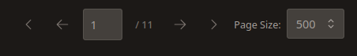
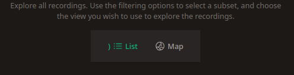

# Data Exploration

_Whombat_ allows you to delve deep into your meticulously curated data through a variety of exploration tools.
Discover patterns, gain insights, and refine your understanding of your audio recordings, audio clips, and sound events.

Key Exploration Areas:

1. Recordings: Explore metadata, locations, and spectrograms of your audio recordings.
2. Audio Clips: Examine specific segments of your recordings in detail.
3. Sound Events: Analyze and visualize sound events within their feature space

## Accessing Data Exploration

To begin your exploration, click on the "Exploration" button on the sidebar or use the navigation cards on the home page.

<figure markdown="span">
    { width="200" }
    <figcaption>Button D will take you to the exploration section</figcaption>
</figure>

Once you're in the exploration section, you can choose what you want to explore (recording, clips or sound events) and your preferred view – typically, a list format or a gallery format is available.

<figure markdown="span">
    { width="400" }
</figure>

## Controlling the Number of Items Displayed

The exploration pages provide tools to navigate through all the items registered in _Whombat_.
To ensure smooth performance, only a limited number of items are displayed at a time.
You can see the current viewing range and the total number of items in the top left corner:

<figure markdown="span">
    { width="250" }
</figure>

To navigate through the list and adjust the number of items displayed simultaneously, use the pagination controls located in the top right corner:

<figure markdown="span">
    { width="400" }
</figure>

## Filtering Items

To refine the list of items you're currently viewing, you can apply custom filters.
The filtering controls are situated in the top left corner:

<figure markdown="span">
    { width="400" }
</figure>

Click on the "Apply filters" button to open the filtering menu, where you can browse and select from the available filters.
Once applied, the filters will appear as badges on the "Filter bar" next to the button.
You can easily remove any filter by clicking on the cross within its corresponding badge.

## Explore recordings on a Map

Visualize the geographical distribution of your recordings by switching to the "Map" tab within the Recording exploration section.

<figure markdown="span">
    { width="400" }
</figure>

The map on the left will display a marker for each recording location.
Clicking on any marker will reveal details about the corresponding recording on the right side of the screen.
You'll be able to view the spectrogram and listen to the audio playback.

<figure markdown="span">
    { width="700" }
</figure>

## Sound Event Scatterplot

Visualize and explore your sound events in a dynamic 3D scatterplot by navigating to the sound event section.
This representation allows you to quickly browse and analyze a large number of sound events within their feature space.

Every sound event is plotted based on three key features: duration, lowest frequency, and highest frequency.
The color of each point corresponds to the species tag associated with the sound event, providing a visual way to identify patterns and clusters.

<figure markdown="span">
    { width="700" }
</figure>

Click on any point in the scatterplot to Get detailed information about the selected sound event and see a focused spectrogram highlighting the chosen sound event.
